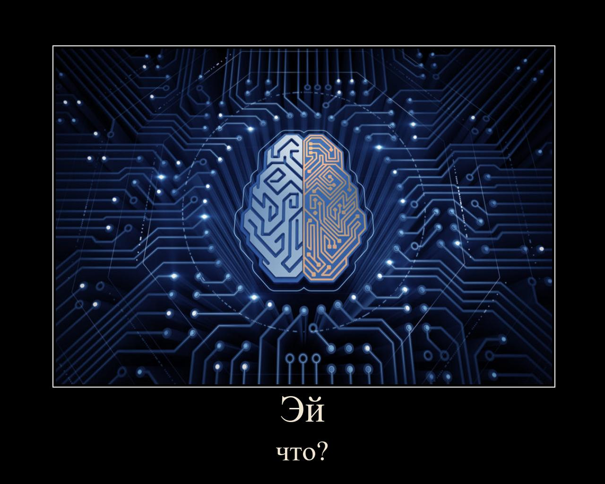

<h1 align="center">SimpleDemotivators</h1>
<p align="center">
    
    
    
    
    <blockquote>Создать демотиватор? Легко!</blockquote>
<hr>



* [English documentation here](./docs/eng.md)

## Установка
1) С помощью установщика pip из GitHub: 
   
   ```sh
   pip3 install https://github.com/Infqq/simpledemotivators/archive/main.zip --upgrade
   ```
2) Для heroku (Тоже с GitHub'а): 
   
   ```sh
   pip3 install https://github.com/Infqq/simpledemotivators/archive/heroku-fix.zip --upgrade
   ```
3) С помощью установщика pip из PyPi: 
   
   ```sh
   pip install simpledemotivators
   ```

### Использование

1. Demotivator() - создает простой демотиватор с дефолтным шаблоном.
```python
from simpledemotivators import Demotivator

dem = Demotivator('Эй', 'что?') #  2 строчки, если вы хотите только одну, то оставьте вторые кавчки пустыми
dem.create('filename.jpg') #  Сохраняет файл под названием - demresult.jpg
                           #  Название изображения, которое будет взято за основу демотиватора
```

2. Quote() - создает цитату "Цитаты великих людей"
```python 
from simpledemotivators import Quote

a = Quote('text', "name")
a.create('filename.png') #  Файл аватарки юзера, сохраняет с названием qresult.jpg
```

3. TextGen() - генерирует текст из исходных данных
```python 
from simpledemotivators import TextGen

rnd_sent = TextGen('Всем привет, я родился')

result = rnd_sent.get_text(min_words=1, max_words=4)

print(result) # Вывод: Привет, всем
```

### Аргументы функции .create() (Demotivator())
| Переменная | Пример | Описание |
| -------- | --------- | ---------|
| result_filename | 'test.png' | Название сохраняемого файла
| text_color | 'white' | Цвет шрифта
| colorfill | 'black' | Цвет заднего фона
| font_name | 'times.ttf' | Название шрифта
| line | 'демотиватор.com' | Вотемарка (только в Demotivator)
| arrange | True/False | Демотиватор регулирует рамки под фотографию
| url | True/False | Если у вас картинка берется с другого ресурса (сайт), то бот сам парсит с этой ссылки картинку. (Вместо файла придется вставлять ссылку)
| delete_file | True/False | После создания демотиватора, ваш файл (который взят за основу демотиватора) будет удален.

### Пример использования:
```python 
from simpledemotivators import Demotivator

dem = Demotivator('Эй', 'что?')
dem.create('A-lbiRuxv_k.jpg', colorfill='black', font_name='arialbd.ttf', line='демотиватор.com', arrange=True)
```

### Пример использования фотографии со стороннего веб ресурса
Допустим, вам нужно спарсить изображение для демотиватора/цитаты с сервера ВК/Дискорда. Чтобы не нагружать ваш код get реквестами, библиотека все сделает за вас.
```python 
from simpledemotivators import Demotivator

dem = Demotivator('Эй', 'что?')
dem.create(r'https://link_to_picture.ru/', url = True)
```

### Документация
* [Возможные ошибки](./docs/errors.md)

[](https://starchart.cc/Infqq/simpledemotivators)
