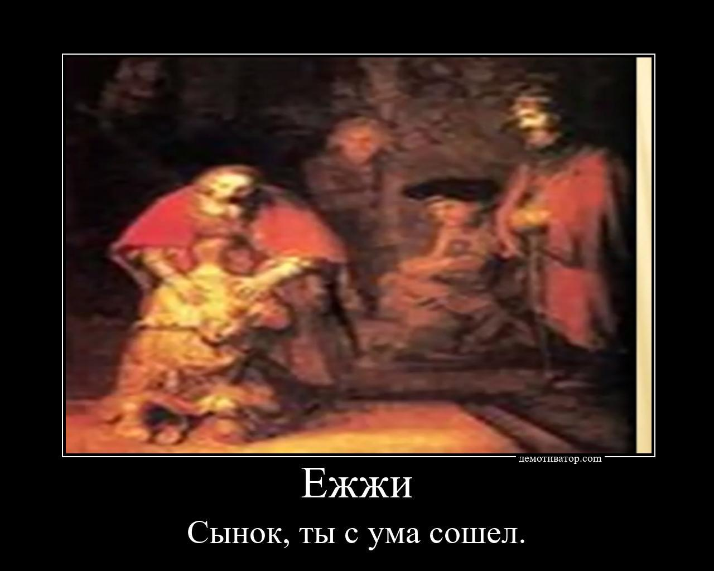

<h1 align="center">SimpleDemotivators</h1>
<p align="center">
    
    
    
    
    <blockquote>Create a demotivators? It's easy!</blockquote>
<hr>

## Installing
1) By installer "pip" from GitHub
   
   ```sh
   pip3 install https://github.com/Infqq/simpledemotivators/archive/main.zip --upgrade
   ```
2) For heroku (Also from GitHub): 
   
   ```sh
   pip3 install https://github.com/Infqq/simpledemotivators/archive/heroku-fix.zip --upgrade
   ```
2) By pip installer from PyPi
   
   ```sh
   pip install simpledemotivators
   ```

### Using
Saving file with title - demresult.jpg

1. Demotivator() - Create simple demotivator
```python
from simpledemotivators import Demotivator

dem = Demotivator('text1', 'text2')
dem.create('filename.jpg')
```

2. Quote() - creating a quote
```python 
from simpledemotivators import Quote

a = Quote('text', "name")
a.get('filename.png')
```

3. TextGen() - generates text from source data
```python 
from simpledemotivators import TextGen

rnd_sent = TextGen('Hi all, I was born')
result = rnd_sent.get_text(min_words=1, max_words=4)
print(result)
```

### Arguments of create() method (class Demotivator ())
| Variable | Example | Description |
| -------- | --------- | ---------|
| result_filename | 'test.png' | Saved file name
| text_color | 'white' | Font color
| colorfill | 'black' | Background color
| font_name | 'times.ttf' | Font filename
| line | 'demotivator.com' | Watermark (only in Demotivator)
| arrange | True/False | Building frames for a photo
| url | True/False | If your image is taken from another resource (website), then the bot itself parses the image from this link. (You will have to insert a link instead of the file)
| delete_file | True/False | After demotivator create, your file for create demotivator, will be deleted

### Example of using
```python 
from simpledemotivators import Demotivator

dem = Demotivator('text1', 'text2')
dem.create('A-lbiRuxv_k.jpg', colorfill='black', font_name='arialbd.ttf', line='demotivator.com', arrange=True)
```

### Example of using image from any web source
```python 
from simpledemotivators import Demotivator

dem = Demotivator('Эй', 'что?')
dem.create(r'https://link_to_picture.ru/', url = True)
```



[](https://starchart.cc/Infqq/simpledemotivators)
