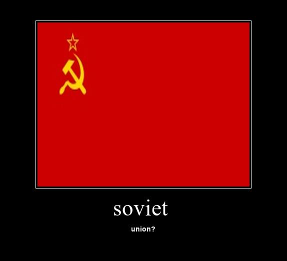

<h1 align="center">SimpleDemotivators</h1>
    <blockquote>Create a demotivator? It's easy!</blockquote>
</p>
<hr>



## Installation
1) Using the pip installer from GitHub: 
   
   ```sh
   pip3 install https://github.com/Infqq/simpledemotivators/archive/main.zip --upgrade
   ```
2) Additionally, download the template.jpg file from the repository

### Using
Saves a file called - demresult.jpg

```python
from simpledemotivators import demcreate

dem = demcreate('soviet', 'union?')
dem.makeImage('filename') #The title of the image that will be taken as a basis for the demotivator
```

or

```python
from simpledemotivators import prodemoty

dem = prodemoty('soviet', 'union?')
dem.setimg(TEMPLATE_COORDS=(75, 45, 499, 373), TEMPLATE_WIDTH = 574, TEMPLATE_HEIGHT = 522, PADDING=10)
dem.setfont(UPPER_FONT = 'times.ttf', UPPER_SIZE = 45, UPPER_FONT_Y = 390, LOWER_FONT = 'arialbd.ttf', LOWER_SIZE = 14, LOWER_FONT_Y = 450)
dem.makeImage('filename')
```

### Documentation (RU)
* [Произвольные демотиваторы](docs/prodemoty.md)
